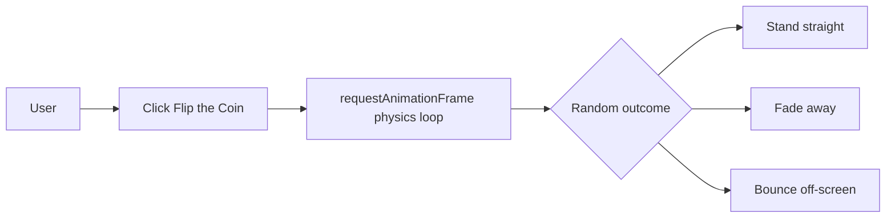

# COIN'T FLIP

## Basic Details

### Team Name

COIN'T FLIP

### Team Members

- Team Lead: Uthara Purushothaman
- Member: Amal K B

Both team members are students of ASIET.

### Project Description

COIN'T FLIP is a deliberately over-engineered coin toss for decisions that do not deserve serious analysis. It combines a slow-motion 3D physics simulation with a playful interface and intentionally unreliable outcomes.

### The Problem (that does not exist)

People are forced to make tiny decisions without knowing whether a coin will stand perfectly upright, vanish into thin air, or bounce away before giving an answer.

### The Solution (that nobody asked for)

COIN'T FLIP simulates gravity, rotation, collisions, shadows, and ridiculous coin behavior in real time. Every toss ends with one of three outcomes: `STANDS STRAIGHT`, `VANISHES`, or `BOUNCES OUT`.

## Technical Details

### Technologies/Components Used

For Software:

- JavaScript and JSX
- React 18
- Vite
- Express and Node.js
- Three.js and React Three Fiber dependencies
- Framer Motion
- Lucide React
- CSS 3D transforms
- `requestAnimationFrame`

For Hardware:

- No hardware required
- Runs in a modern desktop or mobile web browser

### Implementation

The client stores the active physics state in a React ref and updates the coin on every animation frame. Gravity accelerates the coin, collisions apply restitution and damping, and the outcome-specific rules determine whether the coin settles upright, fades away, or exits the scene.

The Express server exposes a decision endpoint that classifies a question into relationship, exam, food, money, sleep, social, or general categories and returns an intentionally unhelpful suggestion with confidence, quality, and regret metadata.

## Installation

From the project root:

```powershell
npm run install:all
```

## Run

Start both the Express server and Vite client:

```powershell
npm run dev
```

Open [http://localhost:5173](http://localhost:5173) in a browser. The Vite client proxies API requests to the Express server on port 3001.

To create a production client build:

```powershell
npm run build
```

## Project Documentation

### API

#### `POST /api/decision`

Request body:

```json
{
  "question": "Should I order dessert?"
}
```

Response fields include `category`, `decision`, `confidence`, `quality`, and `regret`.

#### `GET /api/health`

Returns the service health status:

```json
{
  "ok": true,
  "service": "coin-t-decide"
}
```

## Screenshots


## Diagrams



## Project Demo

### Video

Add a demo video link here showing the three possible coin outcomes and the decision API.

## Additional Demos

- Live client: run `npm run dev` and open [http://localhost:5173](http://localhost:5173)
- API health check: [http://localhost:3001/api/health](http://localhost:3001/api/health)

## Team Contributions

- Uthara Purushothaman: project implementation, React interface, coin physics simulation, styling, and Express API.
- Amal K B: project development and documentation.
---

Made for TinkerHub Useless Projects.